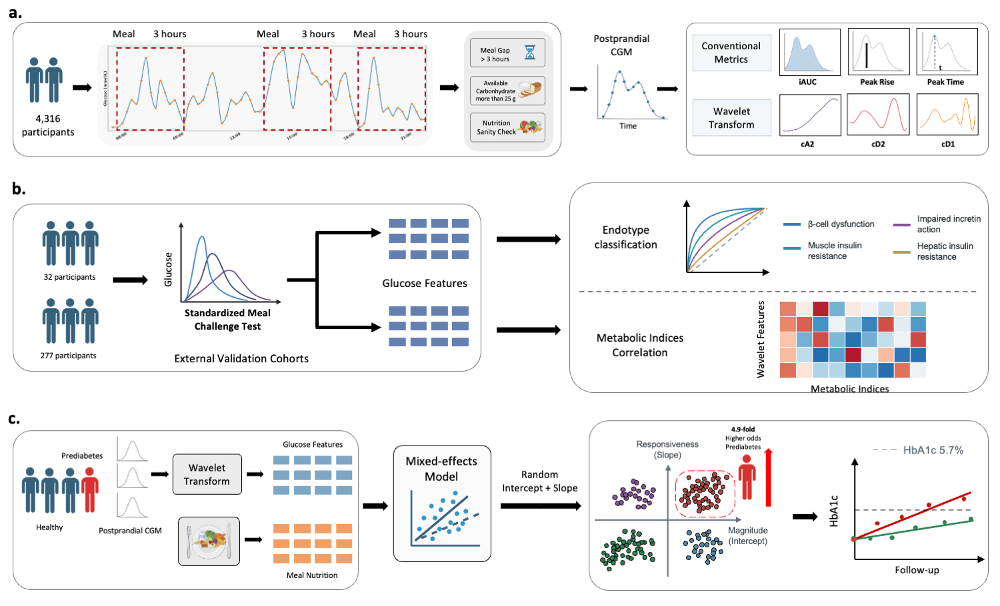

# Temporal structure in postprandial glycemia
This repository contains code for the manuscript "Temporal structure in postprandial glycemia identifies personalized high-risk metabolic profiles". This study analyzed postprandial glucose responses from over 4,000 adults under free-living conditions using multiscale decomposition to characterize broad excursion patterns and finer fluctuations. The study also used two external datasets to evaluate multiscale temporal features for metabolic subtype classification in deeply phenotyped adults and examined associations between temporal glucose features and metabolic indices in young adults.

## Data availability

Access to the Human Phenotype Project (HPP) used in this study can be requested through [https://humanphenotypeproject.org/](https://humanphenotypeproject.org/). The Stanford OGTT dataset is available at [https://www.nature.com/articles/s41551-024-01311-6](https://www.nature.com/articles/s41551-024-01311-6). The COPSAC2000 dataset is available upon request at [mortenr@food.ku.dk](mailto:mortenr@food.ku.dk).